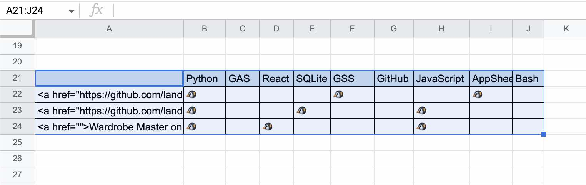
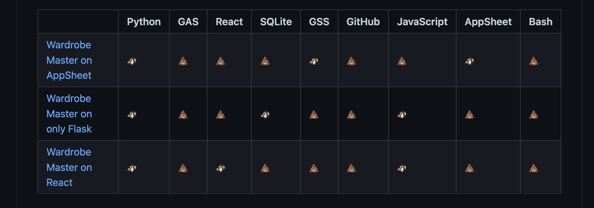

# HtmlGeneratorSheet

Refer [here](https://www.endorphinbath.com/gas-selected-area-to-html-table/).

# Usage

## 1. Before Generating

## 2. Select Area in Spreadsheet and Run `main` script

## 3. After Generating

# Change Log

- 2024/01/30: This funcion has been moved to [this repo](https://github.com/landmaster135/GloveDriveSheet).
- 2024/01/30: Has archived.
